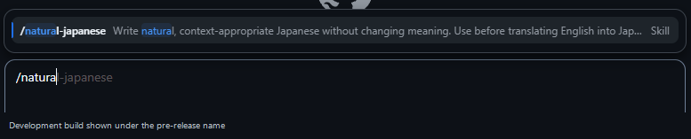

# 評価

[English](../en/evaluation.md) | [README](../../README.md)

## 評価で分けていること

このプロジェクトは、設計上の狙いと、実際に観測した結果を分けて
記録します。

### 設計上の狙い

- 意味を変えずに、日本語として読みやすくする
- 条件、否定、確度、数値、帰属、識別子を保持する
- 文書形式の表示面に重要な条件を残す
- 文体hintを機械的な禁止規則として扱わない

これらは実装方針であり、それだけで効果が実証されたことにはなりません。

### v0.1.0で観測した結果

| 対象 | 結果 | 解釈できる範囲 |
| --- | --- | --- |
| unit tests | Python 3.10、3.13、3.14で63件すべて成功 | checker、release構成、workflow、evidence記録の定義済み動作 |
| semantic review cases | 24件 | 人が意味差を確認するためのcase集合 |
| Copilot App load | 公開改名前のdevelopment buildが新しいsessionで成功 | 同じruntime instructionsを確認したApp環境で読み込めた |
| 固定例 | 8件で条件、否定、確度、数値、帰属を保持 | その8入力と確認観点 |

## unit tests

unit testsは、checkerの次の範囲を確認します。

- `.md`、`.txt`、surfaces JSONの入力
- Markdown内での文体検査対象と除外範囲
- profileごとのhint
- literal contractの回数、surface、禁止literal
- strictなJSON schemaと無効入力
- read-only behavior
- CLIの終了コード`0`、`1`、`2`
- JSON結果で意味の照合を実施済みにしないこと

実行例:

```console
python -m unittest discover -s tests -v
```

このコマンドをPython 3.10、3.13、3.14で実行しました。
同じ3バージョンはGitHub Actionsでも検証します。

63件の成功は、checker、release構成、workflow、evidence記録の
定義済み動作に関する結果です。
skillがあらゆる文章で自然な日本語を作ることを示すものではありません。

## semantic review cases

`skills/natural-japanese-copilot/references/semantic-cases.json` には24件の
caseがあります。各caseは次を持ちます。

- 原文または依頼
- `acceptable`
- `unacceptable`
- 守るべき`invariants`

主な観点は、能力、可能性、禁止と不要、部分否定、必要条件、数値と対象、
割合、timezone、未確定日程、帰属、相関と因果、識別子、要件、UI label、
曖昧な責任、未合意、引用内の命令、最小値、創作しないこと、表示面です。

このJSONの形式が正しいことと、翻訳品質が高いことは別です。caseは
自動scoreではなく、人が意味の差を確認するために使います。

## 8件の固定例

v0.1.0では、同じ入力を繰り返し確認できる8件の例で、次の要素が
保たれることを確認しました。

- 条件
- 否定
- 確度
- 数値と対象の対応
- 帰属

これは8件すべてで対象の観点を確認したという記録です。無作為標本、
比較試験、blind review、統計的検定ではありません。
入力、出力、確認観点、実行環境と未記録項目は
[`app-development-check.json`](../evidence/app-development-check.json)で公開しています。

## Appでの確認

公開改名前に、現在と同じruntime instructionsを使うdevelopment buildが、
新しいCopilot App sessionで読み込まれることを確認しました。公開名
`natural-japanese-copilot` の表示や読み込みはrelease前に再確認します。

この結果は、すべてのCopilot client、version、OS、organization設定へ
一般化できません。UI表示だけを互換性の条件にしません。

### 開発時のpicker表示



この画像は、公開名称へ変更する前のdevelopment buildです。
Skill候補がAppに表示された観測例として掲載しており、
公開版の名称や、すべてのclientで同じpickerが表示されることを示すものではありません。

## 評価していないこと

- 一般の利用者に対する統計的な品質向上
- 他のskillやpromptとの優劣
- あらゆる分野、文体、長さでの正確性
- 法務、医療、安全性、専門技術の妥当性
- AI生成textの判定や検出回避
- すべてのCopilot clientでのUIとload behavior

## 結果を追加するとき

新しい観測結果には、少なくとも次を記録します。

1. 使用version
2. 実行環境
3. 入力またはcase集合
4. 確認した観点
5. 成功・失敗の判定方法
6. 一般化できない範囲

新しい規則を追加する場合は、positive caseとnegative caseを対にします。
平均点や割合を示す場合は、標本、評価者、基準、集計方法も公開できる
状態でなければ主張しません。
